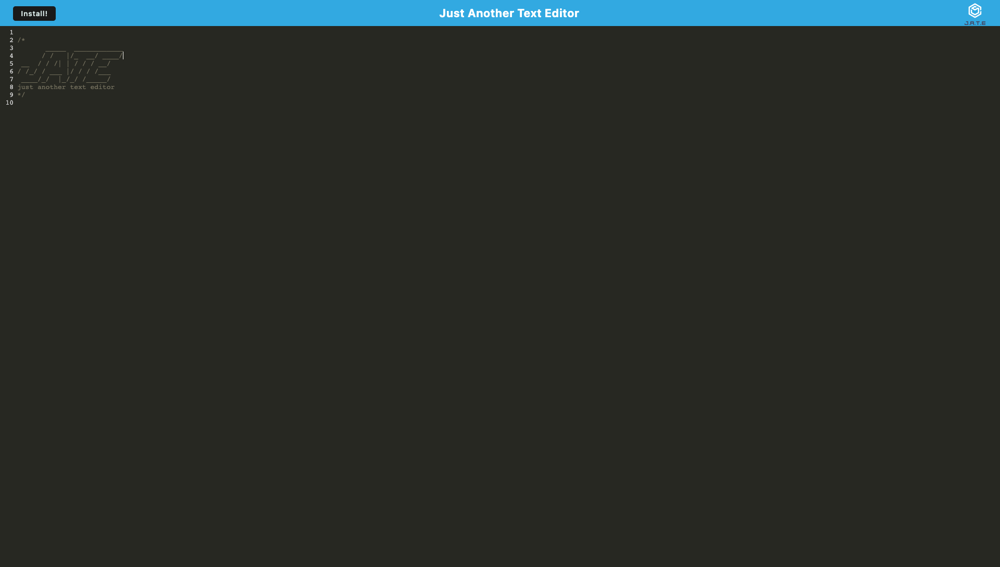

# Text Editor

This project focuses on building a text editor that runs within the browser, showcasing skills relating to Progressive Web Applications. The application is also deployed via heroku which you can find, [here](https://lit-shelf-99409.herokuapp.com/).

## User Story

```md
AS A developer
I WANT to create notes or code snippets with or without an internet connection
SO THAT I can reliably retrieve them for later use
```

## Application



## Technical Elements

- IndexedDB: GET and PUT methods

- No internet connection required

- Bundled with webpack

- Cache statistic assets included in workbox

- Babel for async / await

- Heroku Deployment
